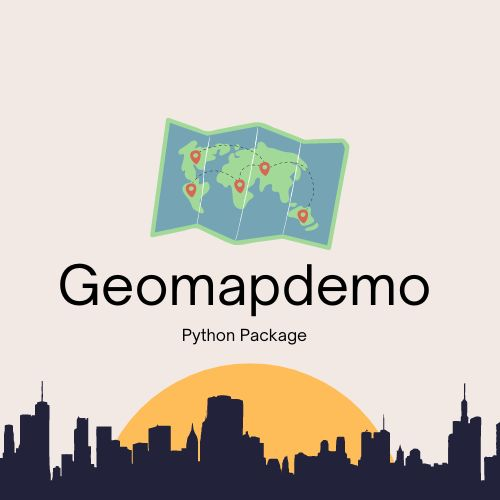

# geomapdemo

**A Python package for interactive mapping.**

## Logo

- Software License: MIT license
- Documentation: https://zyang91.github.io/geomapdemo

## Features

-   Create random numbers and random text
-   Vector and raster layer functions available
-   Ipyleaflet-based interactive map function
-   Folium-based interactive map function
-   Chart module for interactive chart-making

## Supported Python Version
- Python 3
- Python 3.7
- Python 3.8
- Python 3.9
- Python 3.10
- Python 3.11
- Python 3.12

